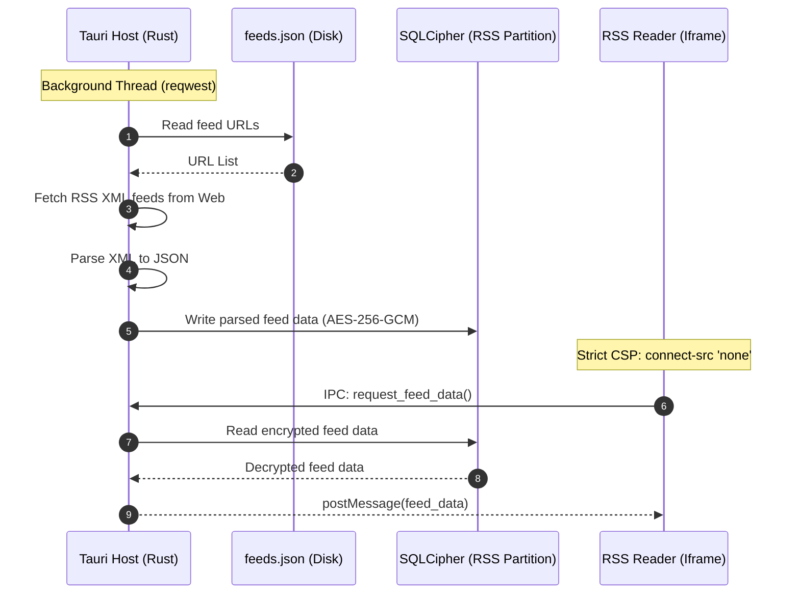
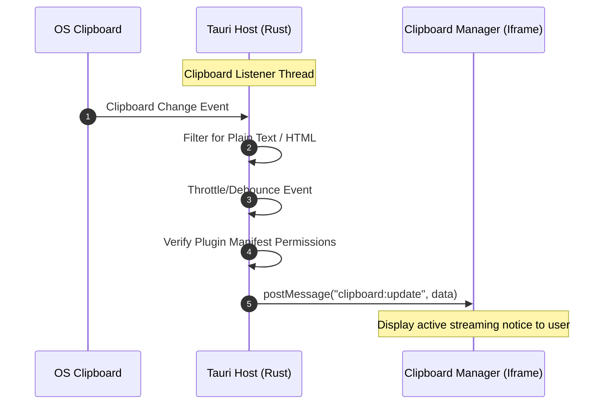
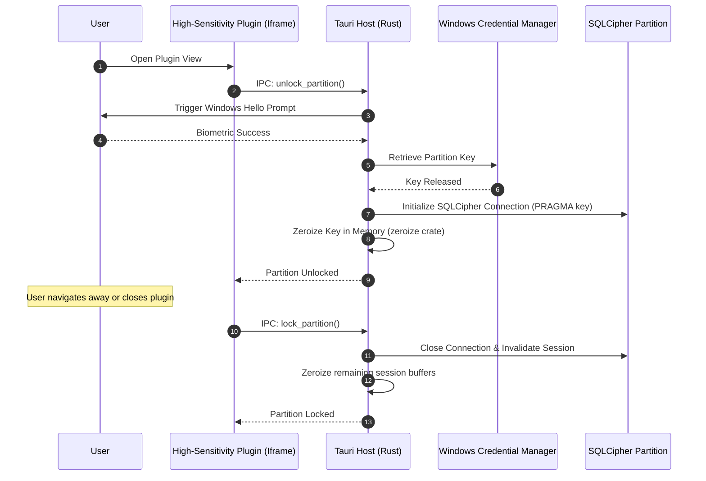

**Phase 2: Planning Mode**

# Technical Architecture Plan: Aether App Suite — Plugin Catalog Expansion

## 1. Requirements Document Summary

This document establishes the technical requirements and architectural specifications for the **Plugin Catalog Expansion** of the Aether App Suite. This expansion is a standalone, post-v1 project enhancement designed to integrate 10 new add-on plugins into the existing Tauri v2 + React desktop application.

### 1.1 Core Security & Isolation Requirements

* **Sandbox Integrity:** All plugins run inside sandboxed iframes served via the custom `plugin://` URI scheme. The Content Security Policy (CSP) strictly enforces `connect-src 'none'`. No plugin iframe may initiate direct network requests.
* **Data Minimization:** Plugins are strictly isolated. Each plugin operates within its own dedicated SQLCipher database partition (AES-256-GCM) and cannot access the main application database or other plugin partitions unless explicit cross-plugin permissions are declared and approved.
* **Independent Biometric Gate with Auto-Relock:** High-sensitivity plugins (Linked Notes, Password Vault) require an independent Windows Hello biometric challenge via the `windows` crate. The released key is held in memory using the `zeroize` crate and is immediately zeroized when the user navigates away from or closes the plugin, relocking the partition.
* **Permission Gating & Schema Validation:** The Data Broker (`src-tauri/src/ipc.rs`) validates all incoming IPC requests against the requesting plugin's manifest permissions. Cross-plugin queries are strictly validated against host-side JSON schemas using the `jsonschema` crate.

### 1.2 Core Integration & Host-Level Requirements

* **Host-Mediated RSS Background Fetcher:** A Rust-based background service (`src-tauri/src/rss.rs`) reads feed URLs from a user-editable configuration file (`feeds.json`), fetches them, and writes them directly to the plugin's encrypted SQLCipher partition, maintaining the strict `connect-src 'none'` CSP sandbox.
* **Host-Active Clipboard Streamer:** A Rust-based clipboard listener (`src-tauri/src/clipboard.rs`) actively streams plain text/HTML clipboard changes to authorized plugins, triggering a mandatory user notification in the UI when streaming is active.
* **SDK Theme Customization API:** An extension to the Core Plugin SDK (`plugins/sdk/src/index.ts`) allows plugins to request custom accent colors dynamically, overriding `--accent` and `--accent-hover` CSS variables.

---

## 2. Task Decomposition & Dependency Graph (DAG)

### 2.1 Task Node Registry

Each task is assigned a weight using the formula:
$$\text{Weight} = \text{Estimated Hours} \times \text{Complexity Factor} \times \text{Risk Factor}$$

* **Complexity Factor Scale:** 1.0 (trivial) to 3.0 (highly complex)
* **Risk Factor Scale:** 1.0 (proven tech) to 2.5 (unfamiliar/uncertain)

| Task ID | Task Name | Est. Hours | Complexity | Risk | Weight | Prerequisites | Phase |
| :--- | :--- | :---: | :---: | :---: | :---: | :--- | :--- |
| **TSK-001** | Data Broker API Extension (JSON Schema Validation) | 12.0 | 1.8 | 1.3 | **28.08** | None | 🔵 Inception |
| **TSK-002** | Host-Mediated RSS Background Fetch Service | 16.0 | 2.0 | 1.5 | **48.00** | None | 🔵 Inception |
| **TSK-003** | Host-Active Clipboard Streaming Service | 10.0 | 1.8 | 1.4 | **25.20** | None | 🔵 Inception |
| **TSK-004** | Independent Biometric Challenge & Auto-Relock | 14.0 | 2.2 | 1.6 | **49.28** | None | 🔵 Inception |
| **TSK-005** | Calendar / Scheduler Plugin | 14.0 | 1.8 | 1.3 | **32.76** | TSK-001 | 🟢 Construction |
| **TSK-006** | Kanban / Project Board Plugin | 14.0 | 1.6 | 1.2 | **26.88** | TSK-001 | 🟢 Construction |
| **TSK-007** | Pomodoro / Focus Timer Plugin | 8.0 | 1.3 | 1.0 | **10.40** | None | 🟢 Construction |
| **TSK-008** | Linked Notes / Knowledge Graph Plugin | 18.0 | 2.2 | 1.5 | **59.40** | TSK-004 | 🟢 Construction |
| **TSK-009** | Password / Secrets Vault Plugin | 10.0 | 1.8 | 1.6 | **28.80** | TSK-004 | 🟢 Construction |
| **TSK-010** | Budget / Expense Tracker Plugin | 12.0 | 1.5 | 1.2 | **21.60** | TSK-001 | 🟢 Construction |
| **TSK-011** | Mood / Wellness Tracker Plugin | 8.0 | 1.2 | 1.0 | **9.60** | None | 🟢 Construction |
| **TSK-012** | Contacts / Mini-CRM Plugin | 10.0 | 1.4 | 1.0 | **14.00** | None | 🟢 Construction |
| **TSK-013** | Clipboard Manager / Snippet Vault Plugin | 9.0 | 1.6 | 1.3 | **18.72** | TSK-003 | 🟢 Construction |
| **TSK-014** | Read-It-Later / RSS Reader Plugin | 10.0 | 1.4 | 1.8 | **25.20** | TSK-002 | 🟢 Construction |
| **TSK-015** | Integration Smoke Testing & Verification | 12.0 | 1.5 | 1.3 | **23.40** | TSK-005, TSK-006, TSK-007, TSK-008, TSK-009, TSK-010, TSK-011, TSK-012, TSK-013, TSK-014 | 🟡 Operations |

### 2.2 Dependency Graph (DAG)

```mermaid
graph TD
%% Host-Level Services (Inception Phase)
TSK-001[TSK-001: Data Broker API Extension] --> TSK-005[TSK-005: Calendar Plugin]
TSK-001 --> TSK-006[TSK-006: Kanban Plugin]
TSK-001 --> TSK-010[TSK-010: Budget Plugin]
TSK-002[TSK-002: RSS Fetch Service] --> TSK-014[TSK-014: RSS Reader Plugin]
TSK-003[TSK-003: Clipboard Streamer] --> TSK-013[TSK-013: Clipboard Manager]
TSK-004[TSK-004: Biometric Key Release] --> TSK-008[TSK-008: Linked Notes Plugin]
TSK-004 --> TSK-009[TSK-009: Password Vault Plugin]

%% Independent Plugins
TSK-007[TSK-007: Pomodoro Timer] --> TSK-015[TSK-015: Smoke Testing]
TSK-011[TSK-011: Mood Tracker] --> TSK-015
TSK-012[TSK-012: Contacts CRM] --> TSK-015

%% Dependent Plugins to Smoke Testing
TSK-005 --> TSK-015
TSK-006 --> TSK-015
TSK-008 --> TSK-015
TSK-009 --> TSK-015
TSK-010 --> TSK-015
TSK-013 --> TSK-015
TSK-014 --> TSK-015

style TSK-001 fill:#3b82f6,stroke:#1d4ed8,stroke-width:2px,color:#fff
style TSK-002 fill:#3b82f6,stroke:#1d4ed8,stroke-width:2px,color:#fff
style TSK-003 fill:#3b82f6,stroke:#1d4ed8,stroke-width:2px,color:#fff
style TSK-004 fill:#3b82f6,stroke:#1d4ed8,stroke-width:2px,color:#fff
style TSK-015 fill:#eab308,stroke:#a16207,stroke-width:2px,color:#fff
```



---

## 3. Critical Path & Graph Analysis

* **Critical Path:** `TSK-004` (Biometric Key Release & Auto-Relock) $\rightarrow$ `TSK-008` (Linked Notes / Knowledge Graph) $\rightarrow$ `TSK-015` (Integration Smoke Testing)
* **Total Weighted Duration:** **132.08 weighted hours** (approx. 44 actual development hours).
* **Shortest Path (Least Resistance to Integration):** `TSK-011` (Mood Tracker) $\rightarrow$ `TSK-015` (Integration Smoke Testing) = **33.00 weighted hours**.

### 3.1 Parallel Tracks & Float (Slack)

* **Data Broker Track (TSK-001 $\rightarrow$ TSK-005/006/010):** Max path weight is 60.84. This track has a float of **47.84 weighted hours** relative to the critical path.
* **RSS Track (TSK-002 $\rightarrow$ TSK-014):** Path weight is 73.20. This track has a float of **35.48 weighted hours**.
* **Clipboard Track (TSK-003 $\rightarrow$ TSK-013):** Path weight is 43.92. This track has a float of **64.76 weighted hours**.
* **Completely Independent Plugins (TSK-007, TSK-011, TSK-012):** These can be built at any time during the construction phase, offering massive parallelization opportunities for a multi-developer team.

### 3.2 Bottleneck Nodes

* **TSK-004 (Biometric Key Release & Auto-Relock):** High weight (49.28) and out-degree of 2. It blocks both the Linked Notes and Password Vault plugins.
* **TSK-001 (Data Broker API Extension):** Out-degree of 3. It blocks the Calendar, Kanban, and Budget plugins.
* **TSK-015 (Integration Smoke Testing):** In-degree of 10. This is the final convergence gate where all plugins must be verified.

---

## 4. Module Breakdown & File Paths

The expansion introduces new files and modifies existing core files within the workspace:

```├── src-tauri/
│   └── src/
│       ├── rss.rs             <-- NEW: Host-side RSS background fetcher
│       ├── clipboard.rs       <-- NEW: Host-side clipboard listener
│       ├── biometrics.rs      <-- MODIFIED: Support independent partition challenges & auto-relock
│       └── ipc.rs             <-- MODIFIED: Standardized read-only query API with JSON Schema validation
└── plugins/
    ├── sdk/
    │   └── src/
    │       └── index.ts       <-- MODIFIED: Add custom accent color request API
    ├── calendar/              <-- NEW: Calendar / Scheduler React App
    ├── kanban/                <-- NEW: Kanban / Project Board React App
    ├── pomodoro/              <-- NEW: Pomodoro / Focus Timer React App
    ├── notes/                 <-- NEW: Linked Notes / Knowledge Graph React App
    ├── vault/                 <-- NEW: Password / Secrets Vault React App
    ├── budget/                <-- NEW: Budget / Expense Tracker React App
    ├── mood/                  <-- NEW: Mood / Wellness Tracker React App
    ├── contacts/              <-- NEW: Contacts / Mini-CRM React App
    ├── clipboard/             <-- NEW: Clipboard Manager React App
    └── rss/                   <-- NEW: RSS Reader React App
```

---

## 5. Data Flow Diagrams

### 5.1 Host-Mediated RSS Background Fetch (TSK-002 $\rightarrow$ TSK-014)



### 5.2 Host-Active Clipboard Streaming (TSK-003 $\rightarrow$ TSK-013)



### 5.3 Independent Biometric Gate & Auto-Relock (TSK-004 $\rightarrow$ TSK-008/009)



---

## 6. Detailed Task Specifications

### 3.1 Host-Level Services (🔵 Inception Phase)

#### `TSK-001`: Data Broker API Extension (JSON Schema Validation)

* **Estimated Hours:** 12.0 | **Complexity:** 1.8 | **Risk:** 1.3 | **Weight:** 28.08
* **Module:** `src-tauri/src/ipc.rs`
* **Dependencies:** None
* **Objective:** Extend the core Data Broker to support a standardized, read-only query API for cross-plugin communication. Enforce strict JSON Schema validation on the Rust host for every query payload.
* **Technical Approach:**
  * Integrate the `jsonschema` crate in Rust.
  * Define static JSON schemas for allowed cross-plugin queries (e.g., `todo:get_tasks`, `goals:get_milestones`).
  * Intercept incoming IPC requests in `ipc.rs`. Validate the payload against the corresponding schema before executing the query.
  * Reject invalid payloads with descriptive, non-sensitive error messages.
* **Files to Create/Modify:**
  * `src-tauri/src/ipc.rs` (Modify to add schema validation and query routing)
  * `src-tauri/schemas/` (New directory containing `.json` schema definitions)
* **Acceptance Criteria:**
  * [ ] Host successfully parses and validates incoming query payloads against JSON schemas.
  * [ ] Malformed payloads are rejected immediately with a `400 Bad Request` equivalent IPC error.
  * [ ] Authorized, valid queries successfully return read-only datasets to the requesting plugin.

#### `TSK-002`: Host-Mediated RSS Background Fetch Service

* **Estimated Hours:** 16.0 | **Complexity:** 2.0 | **Risk:** 1.5 | **Weight:** 48.00
* **Module:** `src-tauri/src/rss.rs`
* **Dependencies:** None
* **Objective:** Implement a secure, background RSS fetch service on the Rust host that reads feed URLs from a user-editable configuration file, fetches them, and writes them directly to the plugin's encrypted SQLCipher partition.
* **Technical Approach:**
  * Create a background thread/worker in Rust using `tokio` and `reqwest`.
  * Read feed URLs from a user-editable configuration file (`feeds.json`) located in the local app data directory (`%APPDATA%/aether/feeds.json`).
  * Fetch XML feeds, parse them into a structured JSON format, and write them directly to the RSS plugin's SQLCipher database partition.
  * Ensure the plugin iframe's CSP remains strictly set to `connect-src 'none'`.
* **Files to Create/Modify:**
  * `src-tauri/src/rss.rs` (New background fetch service)
  * `src-tauri/src/lib.rs` (Initialize the background service on startup)
* **Acceptance Criteria:**
  * [ ] Background service successfully reads URLs from `%APPDATA%/aether/feeds.json`.
  * [ ] Feeds are fetched, parsed, and written to the encrypted SQLCipher partition without blocking the main thread.
  * [ ] The RSS Reader plugin can read the data from its partition without making outbound network requests.

#### `TSK-003`: Host-Active Clipboard Streaming Service

* **Estimated Hours:** 10.0 | **Complexity:** 1.8 | **Risk:** 1.4 | **Weight:** 25.20
* **Module:** `src-tauri/src/clipboard.rs`
* **Dependencies:** None
* **Objective:** Implement a host-side clipboard listener that monitors the OS clipboard, filters for plain text/HTML, and actively streams changes to authorized plugins.
* **Technical Approach:**
  * Use native Tauri clipboard APIs or a specialized crate (e.g., `clipboard-master`) to listen for OS clipboard changes.
  * Filter out non-textual data (e.g., files, images, rich binary formats) to prevent performance degradation and security leaks.
  * Stream plain text/HTML updates to the frontend via Tauri events.
  * Expose a permission gate (`clipboard:subscribe`) in the plugin manifest.
* **Files to Create/Modify:**
  * `src-tauri/src/clipboard.rs` (New clipboard listener service)
  * `src-tauri/src/ipc.rs` (Add permission check for clipboard streaming)
* **Acceptance Criteria:**
  * [ ] Host successfully detects clipboard changes and filters out non-text/HTML data.
  * [ ] Changes are streamed to the frontend only if the active plugin has the `clipboard:subscribe` permission.
  * [ ] A clear, non-intrusive visual notice is displayed to the user when clipboard streaming is active.

#### `TSK-004`: Independent Biometric Challenge & Auto-Relock

* **Estimated Hours:** 14.0 | **Complexity:** 2.2 | **Risk:** 1.6 | **Weight:** 49.28
* **Module:** `src-tauri/src/biometrics.rs`
* **Dependencies:** None
* **Objective:** Implement a dedicated biometric challenge handler for high-sensitivity plugins (Linked Notes, Password Vault). Ensure keys are zeroized and partitions are relocked immediately when the user leaves the plugin.
* **Technical Approach:**
  * Extend `biometrics.rs` to support independent, named biometric challenges via Windows Hello (`UserConsentVerifier`).
  * On successful verification, release the specific partition key from the Windows Credential Manager, unlock the SQLCipher partition, and hold the key in memory using the `zeroize` crate.
  * Implement an explicit `lock_partition` command. Trigger this command from the frontend when the plugin iframe is unmounted, loses focus, or when the user switches active views.
  * Zeroize the key buffer in memory immediately upon relocking.
* **Files to Create/Modify:**
  * `src-tauri/src/biometrics.rs` (Modify to support independent challenges)
  * `src-tauri/src/database.rs` (Implement partition-specific locking/unlocking and zeroization)
* **Acceptance Criteria:**
  * [ ] Opening Linked Notes or Password Vault triggers a dedicated Windows Hello prompt.
  * [ ] Navigating away from the plugin immediately triggers the `lock_partition` command.
  * [ ] Memory inspection confirms the partition key is zeroized and the database connection is closed/invalidated upon relock.

---

### 3.2 Plugin Implementation (🟢 Construction Phase)

#### `TSK-005`: Calendar / Scheduler Plugin

* **Estimated Hours:** 14.0 | **Complexity:** 1.8 | **Risk:** 1.3 | **Weight:** 32.76
* **Module:** `plugins/calendar/`
* **Dependencies:** `TSK-001`
* **Objective:** Build a calendar interface that aggregates tasks and goals from other plugins using the Data Broker's read-only query API.
* **Technical Approach:** Use the extended SDK to query `todo:get_tasks` and `goals:get_milestones`. Render them on a responsive monthly/weekly calendar grid built with Tailwind CSS and shadcn/ui.

#### `TSK-006`: Kanban / Project Board Plugin

* **Estimated Hours:** 14.0 | **Complexity:** 1.6 | **Risk:** 1.2 | **Weight:** 26.88
* **Module:** `plugins/kanban/`
* **Dependencies:** `TSK-001`
* **Objective:** Build a visual Kanban board that shares the `todo` namespace.
* **Technical Approach:** Implement drag-and-drop columns (Todo, In Progress, Done) using `@hello-pangea/dnd` or similar. Read and write tasks directly to the shared `todo` namespace via the Data Broker.

#### `TSK-007`: Pomodoro / Focus Timer Plugin

* **Estimated Hours:** 8.0 | **Complexity:** 1.3 | **Risk:** 1.0 | **Weight:** 10.40
* **Module:** `plugins/pomodoro/`
* **Dependencies:** None
* **Objective:** Build a lightweight, self-contained focus timer.
* **Technical Approach:** Implement a standard Pomodoro timer with customizable intervals. Broadcast session completion events to the Data Broker for other plugins to optionally consume.

#### `TSK-008`: Linked Notes / Knowledge Graph Plugin

* **Estimated Hours:** 18.0 | **Complexity:** 2.2 | **Risk:** 1.5 | **Weight:** 59.40
* **Module:** `plugins/notes/`
* **Dependencies:** `TSK-004`
* **Objective:** Build an Obsidian-style markdown note-taking tool with backlinking and an animated SVG knowledge graph view.
* **Technical Approach:** Implement markdown parsing and backlink indexing. Render the knowledge graph using a force-directed layout in SVG/D3. Ensure the plugin triggers the biometric challenge on load and the relock command on unmount.

#### `TSK-009`: Password / Secrets Vault Plugin

* **Estimated Hours:** 10.0 | **Complexity:** 1.8 | **Risk:** 1.6 | **Weight:** 28.80
* **Module:** `plugins/vault/`
* **Dependencies:** `TSK-004`
* **Objective:** Build a secure credential and secrets manager.
* **Technical Approach:** Implement secure password generation, category filtering, and search. Enforce strict clipboard write-only permissions via the Data Broker. Ensure biometric challenge on load and immediate relock on unmount.

#### `TSK-010`: Budget / Expense Tracker Plugin

* **Estimated Hours:** 12.0 | **Complexity:** 1.5 | **Risk:** 1.2 | **Weight:** 21.60
* **Module:** `plugins/budget/`
* **Dependencies:** `TSK-001`
* **Objective:** Build a personal finance tracker that links spending limits to savings goals.
* **Technical Approach:** Implement expense logging and category budgeting. Query the Goals Tracker plugin via the Data Broker to display progress toward linked savings goals.

#### `TSK-011`: Mood / Wellness Tracker Plugin

* **Estimated Hours:** 8.0 | **Complexity:** 1.2 | **Risk:** 1.0 | **Weight:** 9.60
* **Module:** `plugins/mood/`
* **Dependencies:** None
* **Objective:** Build a self-contained daily wellness check-in tool.
* **Technical Approach:** Create a clean, visual interface for logging mood, sleep, and energy levels. Persist data locally within its isolated SQLCipher partition.

#### `TSK-012`: Contacts / Mini-CRM Plugin

* **Estimated Hours:** 10.0 | **Complexity:** 1.4 | **Risk:** 1.0 | **Weight:** 14.00
* **Module:** `plugins/contacts/`
* **Dependencies:** None
* **Objective:** Build a lightweight contact and relationship manager.
* **Technical Approach:** Implement contact CRUD, tagging, and interaction logging. Persist data locally within its isolated SQLCipher partition.

#### `TSK-013`: Clipboard Manager / Snippet Vault Plugin

* **Estimated Hours:** 9.0 | **Complexity:** 1.6 | **Risk:** 1.3 | **Weight:** 18.72
* **Module:** `plugins/clipboard/`
* **Dependencies:** `TSK-003`
* **Objective:** Build a clipboard history tracker and text snippet manager.
* **Technical Approach:** Subscribe to the host's clipboard stream. Display a persistent, non-intrusive notice to the user that clipboard monitoring is active. Store history securely in SQLCipher.

#### `TSK-014`: Read-It-Later / RSS Reader Plugin

* **Estimated Hours:** 10.0 | **Complexity:** 1.4 | **Risk:** 1.8 | **Weight:** 25.20
* **Module:** `plugins/rss/`
* **Dependencies:** `TSK-002`
* **Objective:** Build an offline-first RSS feed aggregator and article reader.
* **Technical Approach:** Read pre-fetched feed data from the local SQLCipher partition. Render articles in a clean, distraction-free reader view. No outbound network requests are made by the plugin.

---

### 3.3 Integration & Verification (🟡 Operations Phase)

#### `TSK-015`: Integration Smoke Testing & Verification

* **Estimated Hours:** 12.0 | **Complexity:** 1.5 | **Risk:** 1.3 | **Weight:** 23.40
* **Module:** Entire Workspace
* **Dependencies:** All Plugins (`TSK-005` through `TSK-014`)
* **Objective:** Conduct comprehensive integration testing, security audits, and performance verification of the entire expanded plugin catalog.
* **Technical Approach:**
  * Verify that all 10 plugins load correctly within their sandboxed iframes.
  * Audit CSP headers to ensure `connect-src 'none'` is strictly enforced and no external network leaks occur.
  * Verify that the independent biometric gates successfully prompt and immediately relock/zeroize keys on plugin navigation.
  * Verify that the host-side JSON Schema validation correctly blocks malformed cross-plugin queries.
  * Verify that clipboard streaming and RSS background fetching operate within performance budgets without blocking the main thread.
* **Acceptance Criteria:**
  * [ ] All 10 plugins pass functional smoke tests.
  * [ ] Security audit confirms zero plaintext leaks and strict sandbox isolation.
  * [ ] Performance benchmarks confirm zero main-thread blocking during background operations.

---

## 7. Execution Strategy & HITL Gates

> **Phase Gate Policy:** Each phase concludes with a mandatory **Testing Gate**.
> The gate must return **ALL GREEN** (zero errors, zero warnings) before the next phase may begin.
> If any check fails, the current phase must be remediated and the gate re-run.

### Phase 1: Host-Level Services (🔵 Inception Phase)

* **Focus:** Data Broker API Extension, RSS Background Fetcher, Clipboard Streamer, Biometric Gate & Auto-Relock.
* **Tasks:** `TSK-001`, `TSK-002`, `TSK-003`, `TSK-004`
* **HITL Gate 1:**
  * `cargo check` returns 0 errors.
  * `cargo clippy -D warnings` returns 0 warnings.
  * `cargo fmt` passes.
  * JSON schemas are successfully compiled and validated.

### Phase 2: Plugin Implementation (🟢 Construction Phase)

* **Focus:** Build all 10 expansion plugins using the Core Plugin SDK.
* **Tasks:** `TSK-005` through `TSK-014`
* **HITL Gate 2:**
  * TypeScript typecheck passes for all plugins.
  * ESLint returns 0 errors across the `plugins/` workspace.
  * Vite build succeeds for all 10 plugins.

### Phase 3: Integration & Verification (🟡 Operations Phase)

* **Focus:** Integration smoke testing, security auditing, and performance verification.
* **Tasks:** `TSK-015`
* **HITL Gate 3:**
  * All 10 plugins load, render, and function correctly within their sandboxed iframes.
  * Security audit confirms zero plaintext leaks and strict sandbox isolation.
  * Performance benchmarks confirm zero main-thread blocking during background operations.