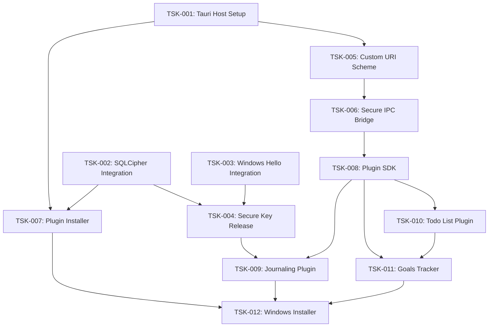
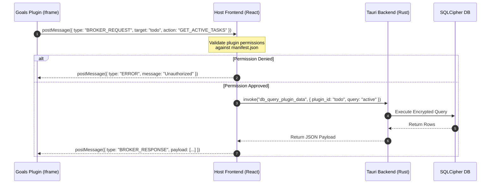

**Phase 2: Planning Mode**

# Technical Architecture Plan: Modular Desktop App Platform (Tauri + Windows 11)

This document establishes the complete technical architecture and dependency-aware execution plan for the modular desktop application platform. It is optimized for direct ingestion by the downstream pipeline (Task Extractor, Graph Engine, and AIDLC Generator).

---

## 1. Executive Summary & Requirements Summary

The objective is to build a high-performance, secure, and extensible Windows 11 desktop application using **Tauri v2** and **React**. The application features a sandboxed plugin architecture allowing users to import and run local plugins (Todo List, Goals Tracker, and Journaling) with host-mediated data sharing. Plugins are packaged as zip files containing all files needed to run, at minimum pre-built static assets and a `manifest.json`.

### Core Requirements

* **Host Environment:** Tauri v2 (Rust backend) with a React + TypeScript + Tailwind CSS frontend styled to match Windows 11 Fluent Design guidelines.
* **Plugin Sandbox:** Plugins run inside an `iframe` with strict sandboxing (`sandbox="allow-scripts"`). They are served via a custom Tauri URI scheme (`plugin://`) to prevent directory traversal and cross-origin issues.
* **Biometric Security:** Integration with Windows Hello via the Windows Biometric Framework (`UserConsentVerifier`). The application must gracefully degrade (e.g., allow access with warning or alternative authentication) if Windows Hello is unavailable or not configured on the host machine.
* **Encrypted Storage:** Journal entries and sensitive data are stored in a local SQLite database encrypted with **SQLCipher** (AES-256-GCM) via **rusqlite** with the `bundled-sqlcipher` feature. The decryption key is released from the Windows Credential Manager only after successful Windows Hello authentication.
* **Data Broker:** A secure, permission-gated IPC bridge over `postMessage` that allows plugins to request data from other plugins via the host.

---

## 2. Task Decomposition & Dependency Graph (DAG)

The project is decomposed into 12 discrete tasks. Task weights are calculated using the formula:
$$\text{Weight} = \text{Estimated Hours} \times \text{Complexity Factor} \times \text{Risk Factor}$$

### Task Node Registry

| Task ID | Task Name | Est. Hours | Complexity | Risk | Weight | Prerequisites | AIDLC Phase |
| :--- | :--- | :---: | :---: | :---: | :---: | :---: | :---: |
| **TSK-001** | Tauri Host Setup & Fluent UI Shell | 12 | 1.5 | 1.0 | **18.00** | None | 🔵 Inception |
| **TSK-002** | SQLCipher Database Integration | 16 | 2.0 | 1.8 | **57.60** | None | 🟢 Construction |
| **TSK-003** | Windows Hello Biometric Integration | 14 | 2.2 | 2.0 | **61.60** | None | 🟢 Construction |
| **TSK-004** | Secure Key Release & DB Decryption | 10 | 2.0 | 1.5 | **30.00** | TSK-002, TSK-003 | 🟢 Construction |
| **TSK-005** | Custom URI Scheme & Sandboxed Iframe | 15 | 2.5 | 1.5 | **56.25** | TSK-001 | 🟢 Construction |
| **TSK-006** | Secure IPC Bridge & Data Broker | 20 | 2.5 | 1.8 | **90.00** | TSK-005 | 🟢 Construction |
| **TSK-007** | Plugin Installer & Manager | 12 | 1.8 | 1.2 | **25.92** | TSK-001, TSK-002 | 🟢 Construction |
| **TSK-008** | Core Plugin SDK & React Template | 10 | 1.5 | 1.2 | **18.00** | TSK-006 | 🟢 Construction |
| **TSK-009** | Journaling Plugin (Encrypted) | 16 | 1.8 | 1.2 | **34.56** | TSK-004, TSK-008 | 🟢 Construction |
| **TSK-010** | Todo List Plugin | 10 | 1.2 | 1.0 | **12.00** | TSK-008 | 🟢 Construction |
| **TSK-011** | Goals Tracker Plugin (Data Sharing) | 14 | 2.0 | 1.5 | **42.00** | TSK-008, TSK-010 | 🟢 Construction |
| **TSK-012** | Windows Installer Packaging (NSIS) | 8 | 1.5 | 1.2 | **14.40** | TSK-007, TSK-009, TSK-011 | 🟡 Operations |

### Dependency Graph (DAG)



---

## 3. Critical Path & Graph Analysis

### Critical Path Analysis

The critical path represents the sequence of dependent tasks that determines the minimum possible duration of the project.

$$\text{Critical Path: } \text{TSK-001} \rightarrow \text{TSK-005} \rightarrow \text{TSK-006} \rightarrow \text{TSK-008} \rightarrow \text{TSK-010} \rightarrow \text{TSK-011} \rightarrow \text{TSK-012}$$

* **Total Weighted Duration:** **250.65 weighted hours** (approx. 89 actual development hours).
* **Strategic Directive:** Tasks on this path have zero float. Any delay in the custom URI scheme, IPC bridge, or SDK directly delays the final release. These tasks must be prioritized during resource allocation.

### Parallel Tracks & Float (Slack)

* **Biometrics & Database Track ($\text{TSK-002}, \text{TSK-003} \rightarrow \text{TSK-004}$):** This track runs in parallel with the UI and Sandbox track. $\text{TSK-004}$ has a float of **90.65 weighted hours**. This allows the complex integration of SQLCipher and Windows Hello to be thoroughly tested without impacting the critical path.
* **Plugin Installer ($\text{TSK-007}$):** This task has a float of **152.73 weighted hours**, allowing its implementation to be deferred until the core runtime is stable.
* **Journaling Plugin ($\text{TSK-009}$):** This task has a float of **19.44 weighted hours**, depending on the completion of the secure key release mechanism ($\text{TSK-004}$).

### Bottleneck Nodes

* **$\text{TSK-006}$ (Secure IPC Bridge):** Highest weight task (90.00) and critical gateway for all plugin communication.
* **$\text{TSK-008}$ (Plugin SDK):** Out-degree of 3. All core plugins depend on this SDK. The API contract must be frozen early to prevent downstream churn.
* **$\text{TSK-004}$ (Secure Key Release):** Merges biometrics and database security. It is a critical gatekeeper for the Journaling plugin ($\text{TSK-009}$).
* **$\text{TSK-012}$ (Windows Installer Packaging):** Highest in-degree node on the critical path, requiring completion of Plugin Installer, Journaling, and Goals Tracker before packaging can begin.

---

## 4. Module Breakdown & File Paths

The application structure is mapped to exact relative paths within the project workspace to maintain alignment with the project knowledge graph.

```
├── src-tauri/
│   ├── Cargo.toml
│   └── src/
│       ├── main.rs                 # Host Core Entrypoint
│       ├── biometrics.rs           # Windows Hello Integration
│       ├── database.rs             # SQLCipher Connection Pool
│       └── protocol.rs             # Custom URI Scheme Handler
├── src/
│   ├── main.tsx                    # Host Frontend Entrypoint
│   ├── App.tsx                     # Main Layout & Router
│   ├── components/
│   │   ├── Dashboard.tsx           # Fluent UI Launcher Grid
│   │   └── PluginSandbox.tsx       # Sandboxed Iframe Wrapper
│   └── hooks/
│       └── usePluginManager.ts     # Plugin Loading & State Hook
├── packages/
│   └── sdk/
│       ├── package.json
│       ├── tsconfig.json
│       └── src/
│           └── index.ts            # Plugin SDK (IPC Wrapper)
└── plugins/
    ├── journal/                    # Journaling Plugin (React)
    ├── todo/                       # Todo List Plugin (React)
    └── goals/                      # Goals Tracker Plugin (React)
```

### Module Specifications

#### 1. Host Core Backend (`src-tauri/src/main.rs`)

* **Responsibility:** Initializes the Tauri application, registers custom protocols, and exposes secure commands to the frontend.
* **Interfaces:**
  * `fn install_plugin(zip_path: PathBuf) -> Result<PluginManifest, String>`
  * `fn invoke_biometric_challenge() -> Result<bool, String>`

#### 2. Biometric Manager (`src-tauri/src/biometrics.rs`)

* **Responsibility:** Interfaces with the Windows Biometric Framework using the `windows` crate.
* **Interfaces:**
  * Uses `windows::Security::Credentials::UI::UserConsentVerifier` to request biometric verification.
  * `pub async fn verify_user(prompt: &str) -> Result<bool, windows::core::Error>`

#### 3. Database Manager (`src-tauri/src/database.rs`)

* **Responsibility:** Manages the SQLCipher connection pool and handles cryptographic key operations.
* **Interfaces:**
  * `pub fn initialize_db(key: &[u8]) -> Result<Connection, rusqlite::Error>` — Note: implementation uses `rusqlite` with the `bundled-sqlcipher` feature.
  * Uses the `zeroize` crate to securely wipe the decryption key from memory after database initialization.

#### 4. Plugin Protocol Handler (`src-tauri/src/protocol.rs`)

* **Responsibility:** Registers the `plugin://` custom URI scheme to serve local plugin assets securely.
* **Security Guardrails:**
  * Strictly validates that requested paths resolve within `%LOCALAPPDATA%/Aether AppSuite/plugins/`.
  * Prevents directory traversal attacks (e.g., blocking `..` in paths).
  * Delivers Content Security Policy (CSP) via response headers on plugin asset responses or via a `<meta>` tag in the served plugin HTML.

#### 5. Host Frontend Dashboard (`src/components/Dashboard.tsx`)

* **Responsibility:** Renders a Fluent UI-compliant grid of installed plugins. Clicking an icon mounts the corresponding plugin inside the sandbox.

#### 6. Plugin Sandbox Wrapper (`src/components/PluginSandbox.tsx`)

* **Responsibility:** Renders the sandboxed `iframe` and establishes the host-side `postMessage` listener.
* **Attributes:**

    ```html
    <iframe
      src="plugin://<plugin-id>/index.html"
      sandbox="allow-scripts"
    />
    ```

    CSP is enforced via response headers from the custom protocol handler or via a `<meta>` tag in the served plugin HTML.

* **Security Notes:**
  * Validates `event.origin` against the expected `plugin://` scheme origin. Note: `event.origin` behavior for custom protocols may vary across Tauri v2 versions; implement defensive validation and verify at runtime during HITL Gate 1.

#### 7. Plugin SDK (`packages/sdk/src/index.ts`)

* **Responsibility:** Provides a strongly-typed, promise-based API wrapper for plugins to communicate with the host.
* **Interfaces:**
  * `sdk.db.get(key: string): Promise<any>`
  * `sdk.db.set(key: string, value: any): Promise<void>`
  * `sdk.broker.requestData(targetPlugin: string, query: any): Promise<any>`

---

## 5. Data Flow & Secure IPC Bridge

Plugins are completely isolated and cannot access system resources directly. All operations are brokered by the host via a secure `postMessage` protocol.

### Sequence Diagram: Gated Data Sharing Broker



### IPC Message Schema

All messages traversing the `postMessage` boundary must conform to the following TypeScript interface:

```typescript
interface IPCMessage {
  id: string;          // Unique request ID for promise matching
  type: 'DB_READ' | 'DB_WRITE' | 'BROKER_REQUEST' | 'BIOMETRIC_CHALLENGE';
  pluginId: string;    // Originating plugin ID
  payload: any;
}
```

---

## 6. Compliance & Security Guardrails

To protect sensitive user data (specifically journal entries and personal goals), the application implements strict security controls:

1.  **Data Minimization:**

  * Plugins are only permitted to read and write data within their own isolated namespace in the database, unless explicit cross-plugin permissions are declared in the manifest and approved by the user.

2.  **Zero Plaintext Storage:**

  * Journal entries are encrypted at rest using AES-256-GCM via SQLCipher (rusqlite `bundled-sqlcipher`).
  * No plaintext journal data is ever written to temporary files, cached in unencrypted local storage, or written to application logs.

3.  **Biometric Key Release Lifecycle:**

  * The SQLCipher database key is stored in the Windows Credential Manager, encrypted via DPAPI.
  * The key is only retrieved and loaded into memory after a successful Windows Hello biometric challenge. If Windows Hello is unavailable, the application must degrade gracefully (e.g., prompt for alternative authentication or warn the user).
  * The key is wrapped in a `Zeroize` struct in Rust, ensuring it is overwritten in physical memory as soon as the database connection pool is initialized.

4.  **Sandbox Isolation:**

  * The custom URI scheme (`plugin://`) enforces a strict Content Security Policy (CSP) delivered via response headers or plugin HTML `<meta>` tags.
  * Plugins cannot execute external network requests (`connect-src 'none'`), preventing data exfiltration.

---

## 7. Execution Strategy & HITL Gates

The project will progress through structured execution phases. Human-in-the-Loop (HITL) gates are enforced at critical architectural boundaries.

### Phase 1: Core Infrastructure (🔵 Inception)

* **Focus:** Establish the Tauri host, Fluent UI shell, and the custom URI scheme.
* **Tasks:** TSK-001, TSK-005
* **HITL Gate 1:** Verify that the custom URI scheme successfully serves static assets into a sandboxed `iframe` without console security errors. Confirm `event.origin` behavior for `plugin://` iframes on Windows 11.

### Phase 2: Security & Storage (🟢 Construction)

* **Focus:** Implement SQLCipher, Windows Hello integration, and the secure key release mechanism.
* **Tasks:** TSK-002, TSK-003, TSK-004
* **HITL Gate 2:** Verify that the database cannot be opened without a successful Windows Hello biometric challenge, and confirm that memory zeroization is functioning correctly. Confirm graceful degradation path works when Windows Hello is unavailable.

### Phase 3: Plugin Runtime & SDK (🟢 Construction)

* **Focus:** Build the secure IPC bridge, the data sharing broker, and the Plugin SDK.
* **Tasks:** TSK-006, TSK-007, TSK-008
* **HITL Gate 3:** Audit the IPC bridge for potential prototype pollution or directory traversal vulnerabilities. Verify that unauthorized plugins cannot access the database.

### Phase 4: Plugin Implementation (🟢 Construction)

* **Focus:** Develop the three core plugins using the SDK.
* **Tasks:** TSK-009, TSK-010, TSK-011
* **HITL Gate 4:** Verify that the Goals plugin can successfully query the Todo plugin's data via the host broker, and that the Journal plugin securely encrypts entries.

### Phase 5: Packaging & Release (🟡 Operations)

* **Focus:** Package the application for Windows 11 distribution using a separate build script.
* **Tasks:** TSK-012
* **HITL Gate 5:** Perform a clean installation of the NSIS package on a target Windows 11 machine and verify end-to-end functionality (biometrics, plugin import, and local storage).
