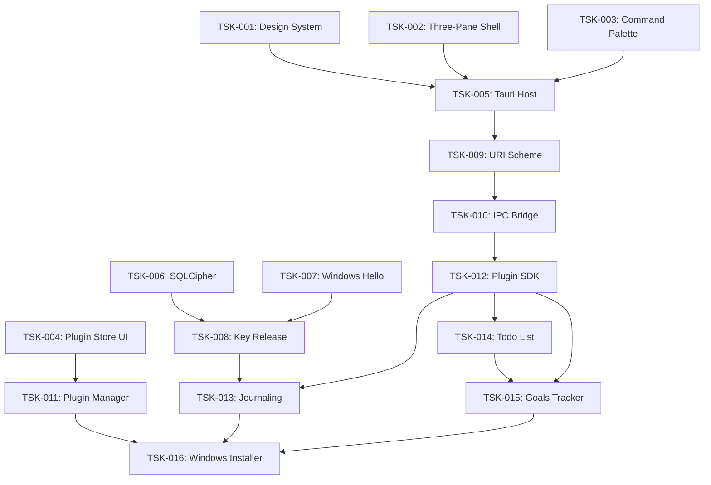

# Aether App Suite — Technical Architecture Specification

## 1. Executive Summary & Requirements

Aether App Suite is a world-class, secure, extensible Windows 11 desktop application built with **Tauri v2** and **React**. It features a sandboxed plugin architecture with a polished, keyboard-first UI inspired by VS Code, Obsidian, Backstage, Raycast, Linear, Notion, Figma, and Arc Browser.

### Core Requirements

- **UI Foundation:** shadcn/ui + Tailwind CSS + CSS custom properties as design token API
- **Three-Pane Shell:** Activity Bar, Sidebar, Main Content, Status Bar (VS Code + Linear pattern)
- **Plugin Sandbox:** Plugins run in sandboxed iframes via custom `plugin://` URI scheme
- **Command Palette:** Universal `Cmd+K` search and command execution (Raycast + Linear pattern)
- **Plugin Store:** Discovery and one-click installation experience
- **Biometric Security:** Windows Hello integration for database key release
- **Encrypted Storage:** SQLCipher (AES-256-GCM) via rusqlite bundled-sqlcipher
- **Data Broker:** Permission-gated IPC bridge for secure cross-plugin communication

---

## 2. Task Decomposition & Dependency Graph (DAG)

The project is decomposed into 16 discrete tasks.

### Task Node Registry

| Task ID | Task Name | Est. Hours | Complexity | Risk | Weight | Prerequisites | Phase |
| :--- | :--- | :---: | :---: | :---: | :---: | :--- | :--- |
| **TSK-001** | Design System Foundation | 12 | 1.2 | 1.0 | **14.40** | None | 🔵 Inception |
| **TSK-002** | Three-Pane Shell | 14 | 1.5 | 1.0 | **21.00** | None | 🔵 Inception |
| **TSK-003** | Command Palette & Keyboard-First Nav | 10 | 1.3 | 1.0 | **13.00** | None | 🔵 Inception |
| **TSK-004** | Plugin Store UI | 8 | 1.2 | 1.0 | **9.60** | None | 🔵 Inception |
| **TSK-005** | Tauri Host Setup & Shell Integration | 12 | 1.5 | 1.0 | **18.00** | TSK-001, TSK-002 | 🟢 Construction |
| **TSK-006** | SQLCipher Database Integration | 16 | 2.0 | 1.8 | **57.60** | None | 🟢 Construction |
| **TSK-007** | Windows Hello Biometric Integration | 14 | 2.2 | 2.0 | **61.60** | None | 🟢 Construction |
| **TSK-008** | Secure Key Release & DB Decryption | 10 | 2.0 | 1.5 | **30.00** | TSK-006, TSK-007 | 🟢 Construction |
| **TSK-009** | Custom URI Scheme & Sandboxed Iframe | 15 | 2.5 | 1.5 | **56.25** | TSK-005 | 🟢 Construction |
| **TSK-010** | Secure IPC Bridge & Data Broker | 20 | 2.5 | 1.8 | **90.00** | TSK-009 | 🟢 Construction |
| **TSK-011** | Plugin Installer & Manager | 12 | 1.8 | 1.2 | **25.92** | TSK-005, TSK-006 | 🟢 Construction |
| **TSK-012** | Core Plugin SDK & React Template | 10 | 1.5 | 1.2 | **18.00** | TSK-010 | 🟢 Construction |
| **TSK-013** | Journaling Plugin | 16 | 1.8 | 1.2 | **34.56** | TSK-008, TSK-012 | 🟢 Construction |
| **TSK-014** | Todo List Plugin | 10 | 1.2 | 1.0 | **12.00** | TSK-012 | 🟢 Construction |
| **TSK-015** | Goals Tracker Plugin | 14 | 2.0 | 1.5 | **42.00** | TSK-012, TSK-014 | 🟢 Construction |
| **TSK-016** | Windows Installer Packaging | 8 | 1.5 | 1.2 | **14.40** | TSK-011, TSK-013, TSK-015 | 🟡 Operations |

### Dependency Graph (DAG)



---

## 3. Critical Path & Graph Analysis

### Critical Path Analysis

The critical path represents the sequence of dependent tasks that determines the minimum possible duration.

$$\text{Critical Path: } \text{TSK-001} \rightarrow \text{TSK-002} \rightarrow \text{TSK-003} \rightarrow \text{TSK-005} \rightarrow \text{TSK-010} \rightarrow \text{TSK-012} \rightarrow \text{TSK-016}$$

- **Total Weighted Duration:** **286.15 weighted hours** (approx. 95 actual development hours).
- **Strategic Directive:** Tasks on this path have zero float. The IPC Bridge (TSK-010) and Plugin SDK (TSK-012) must be prioritized.

### Parallel Tracks & Float (Slack)

- **Security Track (TSK-006, TSK-007 → TSK-008):** Runs in parallel with UI track. TSK-008 has float of **56.00 weighted hours**.
- **Plugin Store UI (TSK-004):** Can be built in parallel with shell. Float of **140.15 weighted hours**.
- **Journaling Plugin (TSK-013):** Has float of **0 weighted hours** on critical path via TSK-008.

### Bottleneck Nodes

- **TSK-010 (Secure IPC Bridge):** Highest weight (90.00). Critical gateway for all plugin communication.
- **TSK-012 (Plugin SDK):** Out-degree of 3. All core plugins depend on this. API contract must be frozen early.
- **TSK-016 (Windows Installer):** Highest in-degree node, requiring Plugin Manager, Journaling, and Goals Tracker.

---

## 4. Module Breakdown & File Paths

```
├── src/
│   ├── main.tsx
│   ├── App.tsx
│   ├── index.css
│   ├── lib/
│   │   ├── design-system/
│   │   │   ├── tokens.css
│   │   │   ├── typography.css
│   │   │   └── components.tsx
│   │   ├── ipc/
│   │   │   ├── broker.ts
│   │   │   └── permissions.ts
│   │   └── commands/
│   │       └── registry.ts
│   ├── components/
│   │   ├── Shell/
│   │   │   ├── Shell.tsx
│   │   │   ├── ActivityBar.tsx
│   │   │   ├── Sidebar.tsx
│   │   │   ├── MainContent.tsx
│   │   │   └── StatusBar.tsx
│   │   ├── CommandPalette/
│   │   │   ├── CommandPalette.tsx
│   │   │   ├── CommandInput.tsx
│   │   │   └── CommandResults.tsx
│   │   ├── PluginStore/
│   │   │   ├── PluginStore.tsx
│   │   │   ├── PluginCard.tsx
│   │   │   └── PluginDetail.tsx
│   │   └── PluginSandbox.tsx
│   └── hooks/
│       ├── useShellState.ts
│       ├── useCommandPalette.ts
│       ├── usePluginManager.ts
│       └── usePluginStore.ts
├── packages/
│   ├── sdk/
│   │   ├── package.json
│   │   ├── tsconfig.json
│   │   └── src/
│   │       └── index.ts
│   └── template/
│       ├── package.json
│       ├── tsconfig.json
│       └── src/
│           ├── App.tsx
│           └── main.tsx
├── plugins/
│   ├── journal/
│   ├── todo/
│   └── goals/
└── src-tauri/
    ├── Cargo.toml
    ├── tauri.conf.json
    └── src/
        ├── main.rs
        ├── lib.rs
        ├── biometrics.rs
        ├── database.rs
        ├── protocol.rs
```

---

## 5. Plugin Registration Contract

Plugins declare their UI integration points via `manifest.json`:

```json
{
  "id": "com.aether.journal",
  "name": "Journal",
  "version": "1.0.0",
  "icon": "📓",
  "ui": {
    "activityBar": true,
    "sidebarSection": "Journal",
    "commands": [
      { "id": "new-entry", "title": "New Journal Entry", "keybinding": "Cmd+Shift+N" }
    ]
  },
  "permissions": ["db:read", "db:write"]
}
```

### Integration Points

| Integration | Manifest Key | Effect |
|-------------|--------------|--------|
| Activity Bar | `ui.activityBar: true` | Icon appears in Activity Bar |
| Sidebar | `ui.sidebarSection` | Section added to Sidebar |
| Commands | `ui.commands[]` | Commands appear in Command Palette |
| Permissions | `permissions[]` | Required for Data Broker access |

---

## 6. IPC Message Schema

All messages traversing the `postMessage` boundary:

```typescript
interface IPCMessage {
  id: string;          // Unique request ID for promise matching
  type: 'DB_READ' | 'DB_WRITE' | 'BROKER_REQUEST' | 'BIOMETRIC_CHALLENGE';
  pluginId: string;    // Originating plugin ID
  payload: any;
}
```

---

## 7. Design Token API

CSS custom properties exposed as public contract between host and plugins:

```css
:root {
  /* Surfaces */
  --canvas: #040506;
  --surface-1: #111214;
  --surface-2: #1b1c1e;
  --surface-3: #252628;
  --border: #2e2f32;

  /* Typography */
  --text-primary: #f0f0f0;
  --text-secondary: #a0a0a0;
  --text-muted: #6b6b6b;

  /* Accents */
  --accent: #55b3ff;
  --accent-hover: #7ac5ff;
  --success: #5fc992;
  --warning: #ffbc33;
  --danger: #ff5f5f;

  /* Spacing */
  --sidebar-width: 260px;
  --activity-bar-width: 64px;
  --status-bar-height: 24px;
}
```

Plugins inherit these automatically. Override allowed but theme preference should be respected.

---

## 8. Compliance & Security Guardrails

1. **Data Minimization:** Plugins only access their own namespace unless explicit cross-plugin permissions granted.
2. **Zero Plaintext Storage:** All sensitive data encrypted at rest via SQLCipher.
3. **Biometric Key Release:** DB key retrieved from Windows Credential Manager only after successful Windows Hello auth. Zeroized in memory via `zeroize` crate.
4. **Sandbox Isolation:** `plugin://` scheme enforces strict CSP. No external network requests (`connect-src 'none'`).
5. **Permission Gating:** All IPC broker requests validated against plugin manifest permissions.

---

## 9. Execution Strategy & HITL Gates

### Phase 1: UI Foundation & Design System

- **Focus:** Design tokens, shell, command palette, plugin store.
- **Tasks:** TSK-001, TSK-002, TSK-003, TSK-004
- **HITL Gate 1:** Visual regression tests pass, all components render correctly with theme tokens, accessibility audit passes.

### Phase 2: Security & Plugin Runtime

- **Focus:** Tauri host, security, sandbox, IPC bridge, SDK.
- **Tasks:** TSK-005, TSK-006, TSK-007, TSK-008, TSK-009, TSK-010, TSK-011, TSK-012
- **HITL Gate 2:** Database encrypted and accessible only via biometrics. IPC bridge passes security audit. Plugin SDK API contract frozen.

### Phase 3: Plugin Implementation

- **Focus:** Build three core plugins with native-feel UI.
- **Tasks:** TSK-013, TSK-014, TSK-015
- **HITL Gate 3:** All plugins load, render, and function. Cross-plugin data sharing works (Goals ↔ Todo). Visual consistency verified.

### Phase 4: Packaging & Release

- **Focus:** Windows installer, clean install verification.
- **Tasks:** TSK-016
- **HITL Gate 4:** Clean install on Windows 11 VM. All features functional. Installer registers protocol and plugins.

---

## 10. Reference Applications

| Application | UI Pattern Borrowed |
|-------------|---------------------|
| **VS Code** | Activity Bar, sidebar panels, command palette, status bar |
| **Obsidian** | CSS variable theming, plugin leaf system, local-first simplicity |
| **Backstage** | Plugin registration contract, consistent chrome, extension points |
| **Raycast** | Keyboard-first design, compact mode, action bar, extension store |
| **Linear** | Ultra-minimal dark UI, accent color, information density |
| **Notion** | Workspace sidebar, block-based plugin UI, template library |
| **Figma** | Plugin modal UI, community marketplace pattern |
| **Arc Browser** | Sidebar-first layout, command bar, translucent surfaces |
